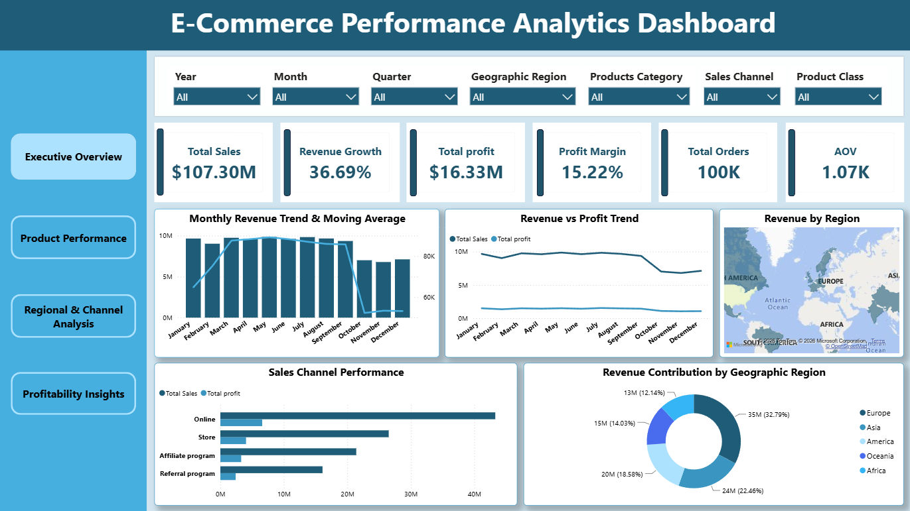
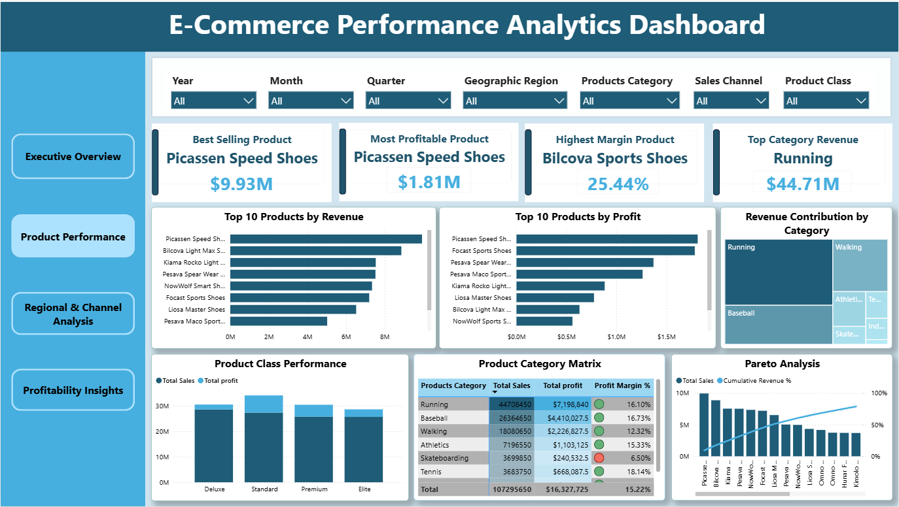
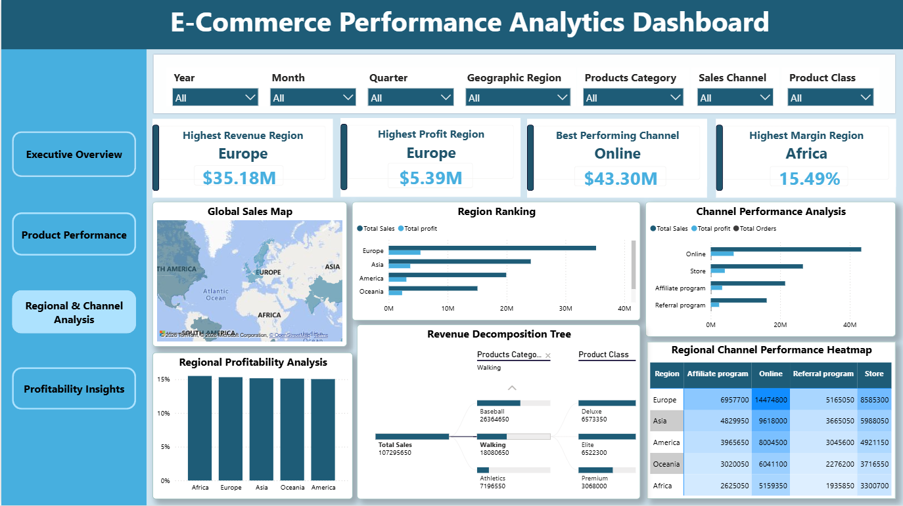
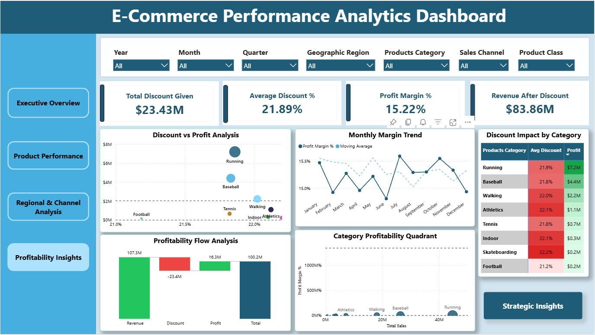
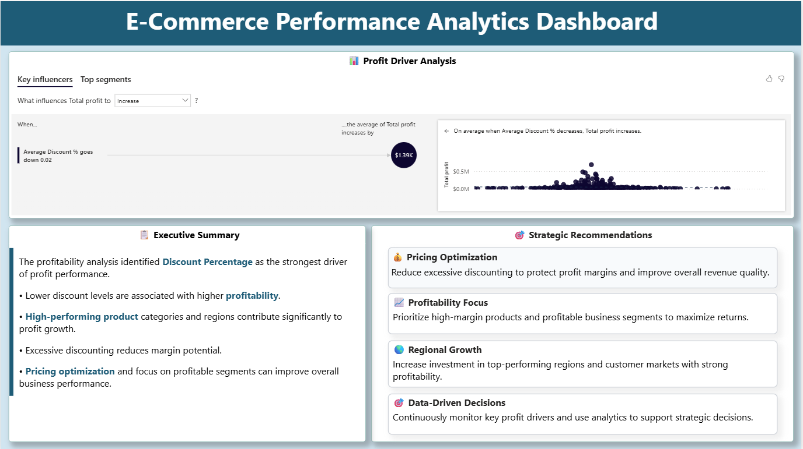

# E-Commerce Performance Analytics Dashboard

## 📊 Project Overview

An interactive Power BI dashboard developed to analyze e-commerce performance across sales, revenue, profitability, discounts, products, regions, and sales channels.

The project uses **100K+ sales records** and combines data modeling, DAX calculations, interactive visualizations, and business intelligence techniques to generate actionable insights.

---

## 🎯 Objectives

- Analyze overall sales and revenue performance
- Identify profitable products and categories
- Evaluate regional and sales-channel performance
- Analyze the impact of discounts on profitability
- Track revenue growth and profit margins
- Identify key factors influencing profit
- Generate data-driven business recommendations

---

## 🛠️ Tools & Technologies

- **Power BI**
- **DAX**
- **Power Query**
- **Data Modeling**
- **Excel / CSV**
- **Data Visualization**
- **Business Intelligence**

---

## 📌 Dashboard Pages

### 1. Executive Overview

Provides a high-level summary of business performance.

**Key Metrics:**
- Total Revenue
- Revenue Growth %
- Total Profit
- Profit Margin %
- Total Orders
- Average Order Value (AOV)

**Key Visuals:**
- Revenue & Profit Trends
- Moving Average
- Revenue by Region
- Sales Channel Performance
- Revenue Contribution by Region

---

### 2. Product Performance

Analyzes product and category-level performance.

**Key Visuals:**
- Top 10 Products by Revenue
- Top 10 Products by Profit
- Revenue by Category
- Product Class Performance
- Product Category Matrix
- Pareto Analysis

**Insights:**
- Identifies best-selling products
- Highlights the most profitable products
- Compares category performance
- Identifies products contributing to the majority of revenue

---

### 3. Regional & Channel Analysis

Evaluates geographical and sales-channel performance.

**Key Visuals:**
- Global Sales Map
- Region Ranking
- Channel Performance
- Region × Channel Heatmap
- Statistical Region Analysis
- Decomposition Tree

**Analysis Dimensions:**
- Geographic Region
- Sales Channel
- Product Category
- Product Class

---

### 4. Profitability Insights

Focuses on profitability and discount-related analysis.

**Key Metrics:**
- Total Discount Given
- Average Discount %
- Profit Margin %
- Revenue After Discount

**Key Visuals:**
- Discount vs Profit Analysis
- Monthly Margin Trend
- Revenue → Discount → Profit Waterfall
- Profitability Quadrant
- Category Discount Impact

---

### 5. Strategic Insights

Uses Power BI's AI-powered analytical capabilities to identify major profit drivers and support business decision-making.

**Key Visuals:**
- Key Influencers
- Business Recommendations

The Key Influencers visual analyzes how factors such as:

- Geographic Region
- Discount %
- Product Category
- Product Class
- Sales Channel

influence overall profitability.

---

## 🧮 DAX & Analytics

Advanced DAX calculations were implemented for:

- Total Revenue
- Total Profit
- Profit Margin %
- Revenue Growth %
- Total Orders
- Average Order Value
- Moving Average
- Product Ranking
- Top-N Analysis
- Cumulative Revenue
- Cumulative Revenue %
- Discount Impact
- Revenue After Discount

These calculations enable dynamic analysis based on user selections and filters.

---

## 📈 Key Business Insights

The dashboard helps identify:

- High-performing products and categories
- High-profit regions and sales channels
- The relationship between discounts and profitability
- Products and categories with strong profit margins
- Revenue concentration using Pareto analysis
- Key factors influencing profit
- Regional and channel growth opportunities

---

## 💡 Business Recommendations

### Optimize Discount Strategy
Reduce excessive discounting, particularly in low-margin categories, to protect profitability.

### Focus on High-Profit Segments
Increase investment in high-performing regions and product categories.

### Improve Product Portfolio
Promote high-margin products and review low-profit categories for pricing and inventory optimization.

### Strengthen Sales Channels
Allocate resources toward channels generating stronger revenue and profit.

### Regional Growth
Identify successful regional strategies and replicate them across similar markets.

### Data-Driven Decision Making
Continuously monitor revenue, profitability, discount impact, and product performance to support strategic planning.

---

## 📷 Dashboard Preview

### Executive Overview

### Product Performance

### Regional & Channel Analysis

### Profitability Insights

### Strategic Insights

---

## 📥 Power BI Project File

The complete Power BI Desktop project is available below:

**[Download E-Commerce Performance Analytics Dashboard (.pbix)](E-commerce_Dashboard.pbix)**

> Open the `.pbix` file using **Microsoft Power BI Desktop** to explore the interactive dashboard, DAX measures, filters, and data model.

---

## 🚀 Project Highlights

- **100K+** sales records analyzed
- **5** interactive dashboard pages
- **30+** visualizations
- Advanced **DAX calculations**
- Interactive slicers and filtering
- AI-powered **Key Influencers**
- **Decomposition Tree** analysis
- **Pareto (80/20) Analysis**
- Profitability and discount analysis
- Data-driven business recommendations

---

## 👨‍💻 Author

**Soumya**

Data Analytics | Python | SQL | Excel | Power BI | Tableau

---

## ⭐ Project Purpose

This project was developed as part of my data analytics portfolio to demonstrate practical skills in **data analysis, data visualization, DAX, business intelligence, and data-driven decision-making using Power BI**.
